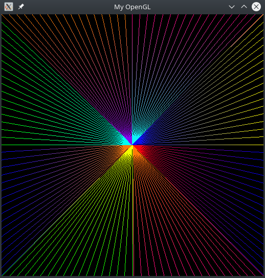

## Atividade 1 - Algoritmos de Rasterização

### Trabalho realizado pelos alunos:

- Vinicius Barbosa de Medeiros - 20170003890
- Jorge Gomes de Melo Júnior - 20170009650

## Objetivo

O propósito do trabalho é implementar funções utilizando algoritmos para a rasteirização de primitivas, que possibilitam a formação de pontos e linhas na tela do computador. A rasterização será feita através da escrita direta na memória, para isso foi utilizado o framework fornecido pelo professor que simula o acesso à memória de vídeo.

## Funções Implementadas

A princípio, foi criado uma estrutura que irá representar cada pixel. Para isso foi criado uma classe `Pixel` que guarda a posição `X` e `Y`, assim como as componentes do sistema RGBA.

```c++
class Pixel {
public:
  Pixel(int x, int y, int R, int G, int B, int A);
  int x, y, R, G, B, A;
  int getX();
  int getY();
};
```

## 1 - putPixel(Pixel pixel)

Para desenhar um pixel na tela, foi criada uma função putPixel que recebe como parâmetro objeto do tipo `Pixel`. Em primeiro lugar é feito uma checagem para saber se o pixel está dentro dos limites da janela criada. Caso ele esteja dentro dos limites o pixel é posto na "memória de vídeo" simulada aqui pelo `FBptr`. É feito o cálculo de `offset` para saber a posição de cada cor do canal RGBA na memória.

Cada pixel contém um par de coordenadas `(X ,Y)` e os valor RGBA.
O RGBA é um sistema de cores aditivas que tem os canais vermelho(red), verde(green), azul(blue) e o alfa (que define a opacidade do pixel) e serve para representar cores.

```c++
void putPixel(Pixel pixel)
{
  if (pixel.x < 0 || pixel.x >= IMAGE_WIDTH || pixel.y < 0 || pixel.y >= IMAGE_HEIGHT)
  {
    return;
  }

  FBptr[(pixel.x * 4) + (pixel.y * IMAGE_WIDTH * 4) + 0] = pixel.R;
  FBptr[(pixel.x * 4) + (pixel.y * IMAGE_WIDTH * 4) + 1] = pixel.G;
  FBptr[(pixel.x * 4) + (pixel.y * IMAGE_WIDTH * 4) + 2] = pixel.B;
  FBptr[(pixel.x * 4) + (pixel.y * IMAGE_WIDTH * 4) + 3] = pixel.A;
}
```

## 2 - drawLine(Pixel initialPixel, Pixel finalPixel)

A função drawLine recebe dois pixels como parãmetros, o pixel inicial e o final da linha.

A rasterização de linhas foi feito utilizando o algoritmo de <i>Bresenham</i>, também chamado de algoritmo do Ponto Médio, baseia-se no argumento de que um segmento de reta, ao ser plotado, deve ser contínuo, ou seja os pixels que compõem um segmento de reta devem ser vizinhos.

<p align="center"> 

</p>

Como o algoritimo funciona apenas para o primeiro octante. É necessário fazer o espelhamento dos demais octantes para o primeiro.

<p align="center"> 

</p>

## Interpolação de Cores

É feito, também, a interpolação de cores. Que funciona da seguinte forma:

```c++
  /* Rate Direction */
  float direction = (abs(dx) >= abs(dy)) ? dx : dy;

  /* Compute RGB change */
  double changeR, changeG, changeB, changeA;

  R = currentPixel.R;
  G = currentPixel.G;
  B = currentPixel.B;
  A = currentPixel.A;

  changeR = (double)(pFinal.R - pInitial.R) / abs(direction);
  changeG = (double)(pFinal.G - pInitial.G) / abs(direction);
  changeB = (double)(pFinal.B - pInitial.B) / abs(direction);
  changeA = (double)(pFinal.A - pInitial.A) / abs(direction);
```

Primeiro e calculado a direção da linha, para saber se o valor será divido pela taxa de variação em X ou em Y. Depois é calculado a taxa de variação para cada canal de cor. Com a seguinte formula:
`(corFinal - corInicial) / módulo(direção)` com esse valor calculado a cada passagem do algoritmo a cor do pixel é incrementada em cada canal. As variáveis `R`,`G`,`B` e `A` recebem a cor do pixel inicial e com o decorrer do algoritmo os valores são incrementados.

```c++
  /* Color Increments */
  R += changeR;
  G += changeG;
  B += changeB;
  A += changeA;

  /* Change current color */
  currentPixel.R = R;
  currentPixel.G = G;
  currentPixel.B = B;
  currentPixel.A = A;

  putPixel(currentPixel);
```

<p align="center"> 

</p>
Código da imagem:

```c++
  /* Left -> Right Diagonal */
  Pixel initialPixelLeftRightDiagonal(0, 0, 0, 0, 255, 255);
  Pixel finalPixelLeftRightDiagonal(512, 512, 255, 0, 127, 255);
  drawLine(initialPixelLeftRightDiagonal, finalPixelLeftRightDiagonal);

  /* Right-> Left Diagonal */
  Pixel initialPixelRightLeftDiagonal(512, 0, 255, 255, 0, 255);
  Pixel finalPixelRightLeftDiagonal(0, 512, 0, 255, 255, 255);
  drawLine(initialPixelRightLeftDiagonal, finalPixelRightLeftDiagonal);

  /* Center Vertical */
  Pixel initialPixelCenterVertical(255, 0, 0, 255, 0, 255);
  Pixel finalPixelCenterVertical(255, 512, 127, 0, 255, 255);
  drawLine(initialPixelCenterVertical, finalPixelCenterVertical);

  /* Center Horizontal */
  Pixel initialPixelCenterHorizontal(0, 255, 255, 0, 0, 255);
  Pixel finalPixelCenterHorizontal(511, 255, 255, 127, 0, 255);
  drawLine(initialPixelCenterHorizontal, finalPixelCenterHorizontal);
```

### Teste dos Octantes

<p align="center"> 

</p>

## 3 - drawTriangle(Pixel p1, Pixel p2, Pixel p3)

A função de desenhar triângulo recebe três pixels como parâmetro e faz a chamada da função `drawLine()` ligando os vétices.

```c++
void drawTriangle(Pixel p1, Pixel p2, Pixel p3)
{
  drawLine(p1, p2);
  drawLine(p2, p3);
  drawLine(p3, p1);
}
```

<p align="center"> 

</p>

Código da imagem:

```c++
	Pixel p1(255, 150, 255, 0, 0, 255);
	Pixel p2(255, 450, 255, 127, 0, 255);
	Pixel p3(125, 500, 255, 255, 0, 255);
	Pixel p4(280, 150, 255, 0, 0, 255);
	Pixel p5(490, 15, 0, 255, 0, 255);
	Pixel p6(400, 450, 0, 0, 255, 255);

	drawTriangle(p1, p2, p3);
	drawTriangle(p4, p5, p6);
```
