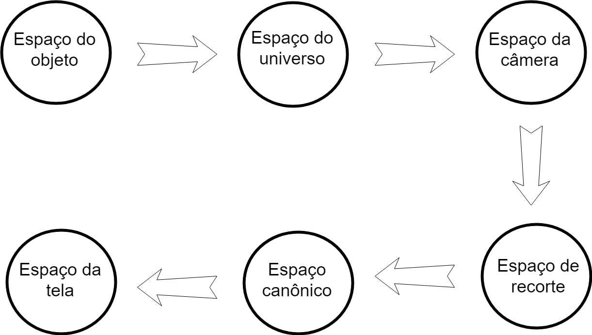

# Atividade 2 - Implementação do Pipeline Gráfico

### Objetivo:

O objetivo do trabalho é implementar um pipeline gráfico completo capaz de transformar vértices descritos no espaço objeto em primitivas rasterizadas no espaço de tela.

### Equipe:

Vinícius Barbosa de Medeiros - 20170003890

Jorge Gomes de Melo Junior - 20170009650

### O que é um pipeline gráfico?

O pipeline gráfico é definido como uma sequência de etapas onde são realizadas transformações nos vértices de um objeto tridimensional para representá-lo em uma tela bidimensional. Todas as transformações foram implementadas em forma de matriz e utilizando coordenadas homogêneas. A seguir vemos todas as etapas do nosso pipeline:  

 

### Espaço do objeto para o do universo:

O espaço objeto é onde cada objeto é criado e moldado a partir de suas primitivas geométricas utilizando o seu próprio sistema de coordenadas. Esta etapa transforma os vértices descritos no espaço do objeto para o espaço do universo, através do produto destes vértices pela matriz chamada Model Matrix, que essa é resultante da multiplicação das matrizes de translação, escala e rotação que posicionam o objeto no universo. 

*[aqui ficaria as imgs das matrizes] VVV*

A matriz de translação define a posição do objeto no espaço do universo:

A matriz de escala remimensiona as dimensões do objeto no espaço do universo:

A matriz de rotação rotaciona o objeto a partir de um ângulo dado no espaço do universo:

Implementamos essas matrizes utlizando a biblioteca GLM:

Essa é a matriz de translação:

    glm::mat4x4 mTranslation = glm::mat4x4(0, 0, 0, 0,
                                           0, 0, 0, 0,
                                           0, 0, 0, 0,
                                           0, 0, 0, 1);
                                         
Essa é a matriz de escala:                                         
                                         
    glm::mat4x4 mScale = glm::mat4x4(0, 0, 0, 0,
                                     0, 0, 0, 0,
                                     0, 0, 0, 0,
                                     0, 0, 0, 1);

Essa é a matriz de rotação:  

    glm::mat4x4 mRotation = glm::mat4x4(cos(angle), 0, -sin(angle), 0,
                                        0, 0, 0, 0,
                                        sin(angle), 0, cos(angle), 0,
                                        0, 0, 0, 1);

Essa é a matriz Model:

    glm::mat4x4 mModel = mTranslation * mScale * mRotation;
    

### Espaço do universo para o da câmera:

Esta etapa transforma os vértices descritos no espaço do universo para o espaço da câmera, através do produto destes vértices pela matriz chamada View Matrix, que para sua construção são necessárias a posição, o vetor que define a orientação (Up) e o vetor look at da câmera que funcionará como ponto de vista para o espaço. Também é construído um novo sistema de eixos a partir desses parâmetros. 

*[imgs das matrizes]*

Implementamos esses dados da seguinte forma:

    glm::vec3 lookCam = glm::vec3(0, 0, 0);
    glm::vec3 posCam = glm::vec3(0, 0, 5);
    glm::vec3 upCam = glm::vec3(0, 1, 0);

    glm::vec3 dirCam = lookCam - posCam;

    glm::vec3 zCam = -glm::normalize(dirCam);
    glm::vec3 xCam = glm::normalize(glm::cross(upCam, zCam));
    glm::vec3 yCam = glm::cross(zCam, xCam);

    glm::mat4x4 B = glm::mat4x4(xCam[0], yCam[0], zCam[0], 0,
                                xCam[1], yCam[1], zCam[1], 0,
                                xCam[2], yCam[2], zCam[2], 0,
                                0, 0, 0, 1);

    glm::mat4x4 T = glm::mat4x4(1, 0, 0, 0,
                                0, 1, 1, 0,
                                0, 0, 0, 0,
                                -dirCam[0], -dirCam[1], -dirCam[2], 1);
                              
Essa é a matriz View:

    glm::mat4x4 mView = B * T;

### Espaço da câmera para o de recorte:

Esta etapa transforma os vértices descritos no espaço da câmera para o espaço do recorte e permite a aplicação da distorção perspectiva, através do produto destes vértices pela matriz chamada Projection Matrix. Após esta transformação, a coordenada homogênea dos vértices geralmente apresentam valores diferentes de 1. 

A variavél __d__ é a distância entre a câmera e o View Plane.

      int d = 1;
      
A matriz de projeção é:      
      
      glm::mat4x4 mProjection = glm::mat4x4(1, 0, 0, 0,
                                            0, 1, 0, 0,
                                            0, 0, 1, -(1 / d),
                                            0, 0, d, 0);

### Espaço de recorte para o canônico:

Esta etapa transforma os vértices descritos no espaço de recorte para o espaço canônico, dividindo as coordenadas destes vértices pela sua coordenada homogênea.   

### Espaço canônico para o da tela:

Esta etapa transforma os vértices descritos no espaço canônico para o espaço da tela, através do produto destes vértices pela matriz chamada ViewPort Matrix, que essa é resultante da multiplicação de matrizes de translação e escala. 

Implementamos os dados anteriores da seguinte forma:

      glm::mat4x4 mVPTranslate = glm::mat4x4(1, 0, 0, 0,
                                             0, 1, 0, 0,
                                             0, 0, 1, 0,
                                             (IMAGE_WIDTH - 1) / 2, (IMAGE_HEIGHT - 1) / 2, 0, 0);
                                             
      glm::mat4x4 mVPScale = glm::mat4x4((IMAGE_WIDTH / 2), 0, 0, 0,
                                         0, (IMAGE_HEIGHT / 2), 0, 0,
                                         0, 0, 1, 0,
                                         0, 0, 0, 1);
                                         
      glm::mat4x4 mVPInvert = glm::mat4x4(1, 0, 0, 0,
                                          0, -1, 0, 0,
                                          0, 0, 1, 0,
                                          0, 0, 0, 1);
                                          
A matriz ViewPort é:

      glm::mat4x4 mVP = mVPScale * mVPTranslate * mVPInvert;

### Resultados

## Considerações finais

## Referências:
Slide fornecido pelo professor.
